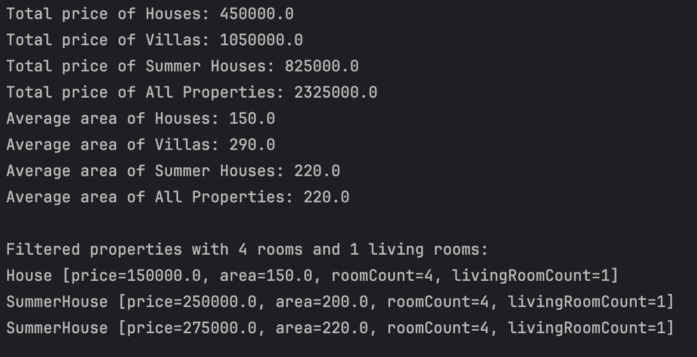

## Real Estate Listing System App

This lightweight Java command-line application models a real estate listing system featuring Houses, Villas, and Summer Houses. It offers core functionalities such as computing total property costs, calculating average areas, and filtering listings based on room count.

### Features

- **Total Price Calculations:**
    - By property type (Houses, Villas, Summer Houses).
    - For all properties combined.
- **Average Area Calculations:**
    - By property type.
    - For all properties combined.
- **Filtering:**
    - Filter properties based on the number of rooms and living rooms.

